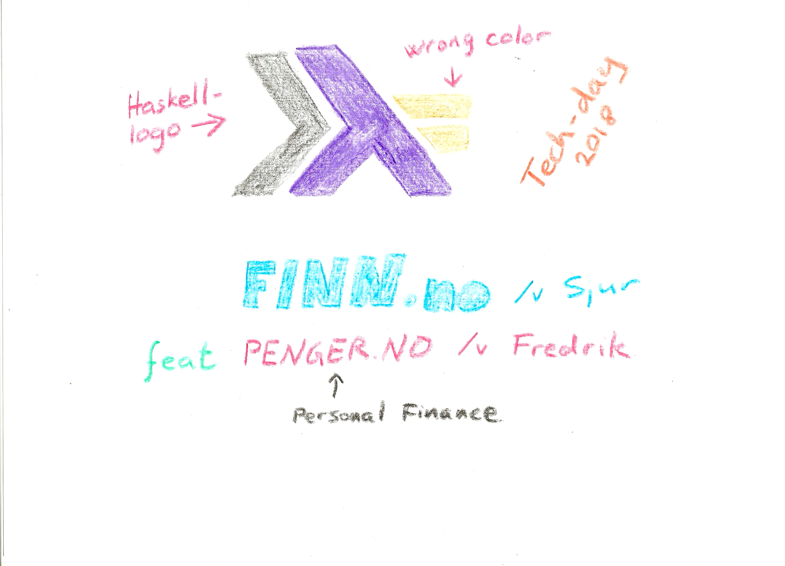
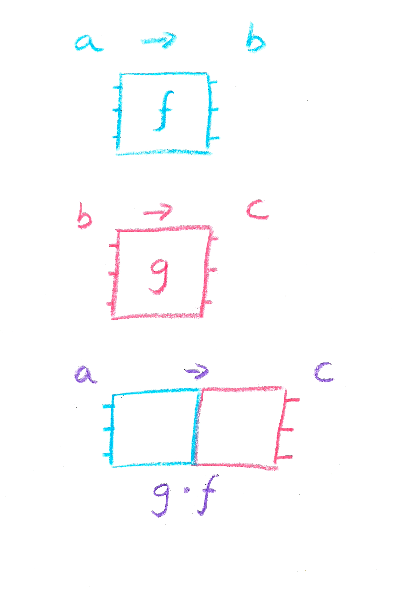
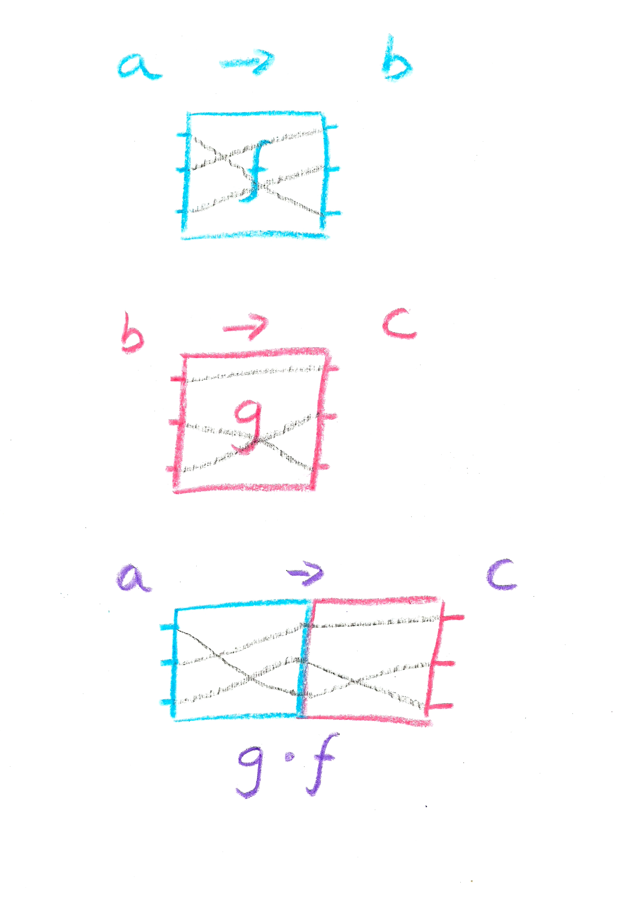
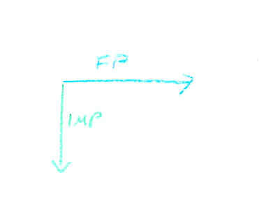

---
title: Haskell Workshop
author: FINN.no
patat:
    wrap: false
    margins:
        left: 5
        right: 10
    incrementalLists: true
    images:
        backend: auto
...

# 



# Haskell

* Haskell / GHC
* Purely functional
* No side-effects
* Lazy
* Mystic \*

\* has monads


# 





# 





# In haskell

```haskell
f :: a -> b

g :: c -> d

g . f
```


# Wire input to output

```haskell
isPrime :: Natural-> Bool
isPrime 0 = False
isPrime 1 = False
isPrime 2 = True
isPrime 3 = True
isPrime 4 = False
isPrime 5 = True
isPrime 6 = False
isPrime 7 = True
```


#




# Wat?

```haskell
validate :: Integer -> Bool
validate = isZeroRem10 . sumDigits . doubleEveryOther . toDigits
```

