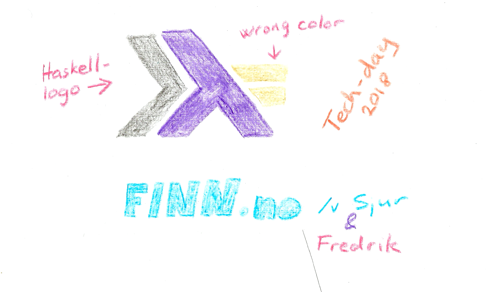

---
title: Haskell Workshop
author: FINN.no
...





### Haskell

- Haskell / GHC
- Purely functional
- Statically Typed
- Lazy


### REPL

    $ stack repl ./src/Part1.hs
    (...)
    *Part1> 


### Unloading and Loading

    *Loaded Modules> :l
    Ok, no modules loaded.
    Prelude>

    Prelude> :l Part1
    Ok, one module loaded.
    *Part1>


### Evaluating values and types

    >1 + 1
    2

    >:t 1
    1 + 1 :: Num a => a


### create a function

```haskell
isPrime :: Int -> Bool
isPrime 0 = False
isPrime 1 = False
isPrime 2 = True
isPrime 3 = True
isPrime 4 = False
isPrime 5 = True
isPrime 6 = False
isPrime 7 = True
```


### Curried signatures

```haskell
myFunction :: Int -> Int -> Int
              ^arg0  ^arg1  ^res
```
```haskell
myFunction :: Int -> (Int -> Int)
              ^arg0  ^res
```

    >:t myFunction 1
    myFunction 1 :: Int -> Int


### create a function 2

```haskell
myFunction :: Int -> Int -> Int
myFunction    a      b   =  (a + 1) * b ^ 2
```

Applying arguments

    > myFunction 1 2
    8


### Everything is an expression

```haskell
isNine :: Int -> Bool
isNine i = if i == 9
  then True
  else False
```

You must have an else


### lists

```haskell
listOfInts :: [Int]
listOfInts  = [1,2,3]

concat :: [a] -> [a] -> [a]
concat as bs = as ++ bs
```


### Tips

- Indentation matters
- Slack : #finn-haskell-workshop
- Examples-folder
- README.md
- presentation/CheatSheet.pdf
- presentation/index.html


### Exercise time :

    ./runtests 1


### let .. in expressions

```haskell
cylVolume :: Float -> Float -> Float
cylVolume diam h =
  let rad = diam / 2
      area = pi * rad^2
  in area * h
```


### Recursion on lists

```haskell
uppercase :: [Char] -> [Char]
uppercase [] = []
uppercase (x:xs) = toUpper x :: uppercase xs
```

`x` is a `Char` but `xs` is a `[Char]`


### Exercise time :

    ./runtests 2


### Exercise time :

    ./runtests 3


### Exercise time :

    ./runtests 4


### Exercise time :

    ./runtests 5    


### Creating a type

```haskell
data TrafficLight = Red | Yellow | Green

safe :: TrafficLight -> Bool
safe Red    = False
safe Yellow = False
safe Green  = True
```


### Part 6

- Tests are green
- Keep them green after bumping to Lib.CCLib2
- Expand the datatype Bit as instructed